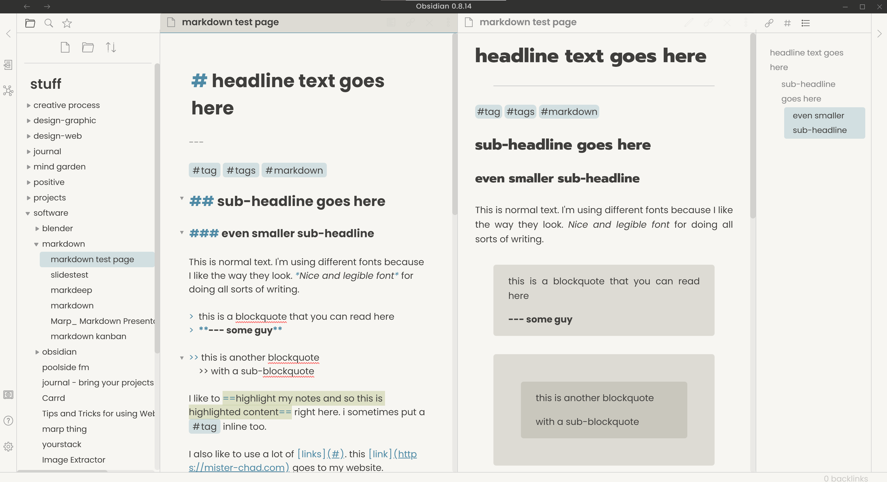

# al dente obsidian theme

a simple minimal theme for [the obsidian notes app](https://obsidian.md/) that is tender, but firm. it is built to be _just right_ for me. hopefully it is just right for others as well. 

---

## theme variation update 2020.01.02

my [warmth theme](https://github.com/chad-bennett/warmth-obsidian-theme) for obsidian is part of the community themes. a lot of people are using it even though it needs a lot of updating and refining. i pulled some of the colors from the warmth theme into al-dente. it has become my main driver. i hope you like it too.

## updated installation

obsidian has an updated way to install multiple themes without having to rely on the default _obsidian.css theme_ in the main folder. 

to install: 
1. download _aldente-warmthColors.css_ folder and place in your _.obsidian/themes_ folder of your repository
2. open obsidian and go to _Settings > Appearance_ and scroll down to _Themes_
3. choose _aldente-warmthColors_
4. enjoy

---
---

# old stuff

## screenshots

_light version is more complete_

_dark version still needs some work_

## notes

i wanted a nice simple interface that was functional and easy on the eyes. 

i started with [the BENFW theme](https://forum.obsidian.md/t/theme-benwf-light-dark-deprecated/1998) back in early summer and have been tinkering with it off and on since. mostly cleaning up colors, alignment, and spacing. i've added several bits and pieces since then. still definitely a work in progress. i mostly use the light theme, but am playing around with dark theme because many people like dark themes. i like warm colors and minimal visual clutter. i get distracted when things don't line up. 

## fonts

you can easily change fonts in the variables at the top of the document. 

i'm using [Poppins](https://www.fontsquirrel.com/fonts/poppins) as the main font, [Prompt](https://fonts.google.com/specimen/Prompt) for headings, and [Courier Prime Code](https://www.fontsquirrel.com/fonts/courier-prime-code) for code blocks.
